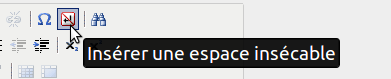

.. _typo:

******************************
Normes typographiques imposées
******************************

.. contents::

Philosophie
===========

Recopier tel quel en tenant compte des normes typographiques imposées.
Si une faute d’orthographe est écrite, la recopier avec [*sic*]
suivant le mot « erroné » (voir `Fautes d’orthographe`_).

Espacements
===========

Légende
-------

| ␣ correspond à une espace normale
| ⍽ correspond à une espace insécable

Une espace insécable permet d’empêcher les retours à la ligne indésirables.

Exemple de retour à la ligne indésirable :

    | Est-ce que j’ai une tête à aller sur une route départementale
    | ?

devient, en mettant une espace insécable entre « départementale » et « ? »
au lieu d’une espace normale :

    Est-ce que j’ai une tête à aller sur une route départementale ?
    

Pour faire une espace insécable :

    * Sous Mac : ``Alt`` + ``Espace``
    * Sous Ubuntu : ``Alt gr`` + ``Majuscule`` + ``Espace``
    * Solution alternative (pour Windows entre autres) : |nbsp|

Ponctuations
------------

====================== === === === === ===
séparateurs simples    .␣  ,␣
séparateurs expressifs ⍽:␣ ⍽;␣ ⍽?␣ ⍽!␣ ⍽/␣
citeurs                ␣«⍽ ␣“⍽ ⍽”␣ ⍽»␣
groupeurs              ␣(  )␣  ␣[  ]␣
====================== === === === === ===

Autres cas
----------

========= ======== ======
n°⍽       p.⍽      f.⍽
XVIIIe⍽s. Louis⍽XV 15⍽000
========= ======== ======

Fautes d’orthographe
====================

Recopiées telles quelles suivies de « [*sic*] ».  « sic » est un mot latin
signifiant « ainsi ».  Le mot « sic » doit être en italique tandis que
les crochets sont droits.  Le mot et « [*sic*] » doivent être séparés
d’une espace insécable.

Exemple :

    La mord [*sic*] frappe encore.

Typographie automatique
=======================

Certaines corrections typographiques sont appliquées automatiquement dans
Dezède :

Espaces
-------

`Légende`_

Correction d’espaces normales en espaces insécables :

| ``␣;`` → ``⍽;``
| ``␣:`` → ``⍽:``
| ``␣?`` → ``⍽?``
| ``␣!`` → ``⍽!``
| ``«␣`` → ``«⍽``
| ``␣»`` → ``⍽»``
| ``“␣`` → ``“⍽``
| ``␣”`` → ``⍽”``
| ``␣/`` → ``⍽/``

Autres
------

| ``'`` → ``’``
